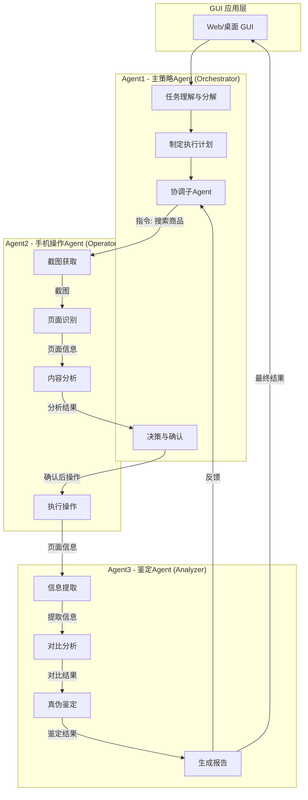
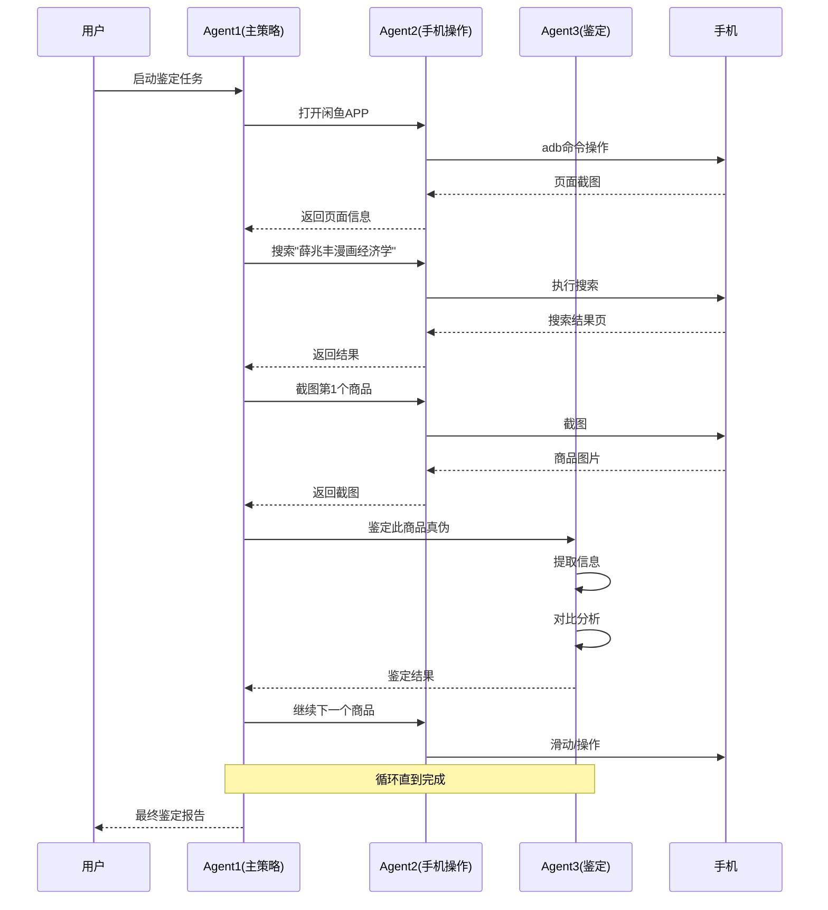
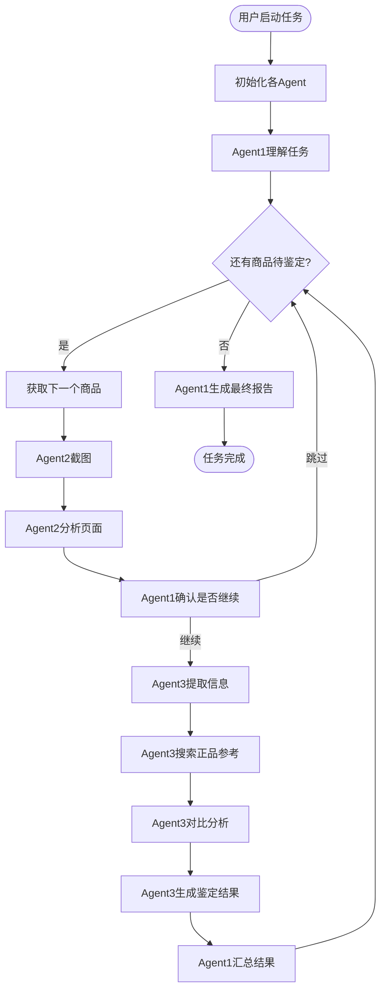

# 商品鉴定助手 (Product Verification Agent)

这是一个通过AI自动对比二手平台商品与官方正品，验证商品真伪的助手程序。

## 系统架构

本系统采用三层Agent架构设计，通过多智能体协作完成商品鉴定任务：

### Agent架构图



### Agent职责说明

| Agent | 名称 | 主要职责 |
|-------|------|---------|
| **Agent1** | 主策略Agent | 理解用户意图、制定任务计划、协调子Agent工作、做出关键决策 |
| **Agent2** | 手机操作Agent | 截图获取、页面识别、内容分析、执行具体操作（点击、输入等） |
| **Agent3** | 鉴定Agent | 提取商品信息、与正品对比、进行真伪鉴定、生成鉴定报告 |

### 交互流程



### 工作流程详解



## 功能概述

- 🔍 **商品搜索**: 在闲鱼、小红书等二手平台搜索商品
- 📖 **正品获取**: 在得到app获取官方正品信息作为参考
- ⚖️ **对比分析**: 自动对比价格、描述、图片等关键信息
- 📊 **鉴定报告**: 生成详细的真伪鉴定报告和购买建议
- 📁 **数据存储**: 自动保存截图、分析结果到带时间戳的目录

## 目录结构

```
bohack-project/
├── main.py                    # 主入口程序
├── main_autoglm.py           # AutoGLM手机控制程序
├── .env                      # 环境变量配置(需填入API密钥)
├── .env.example              # 环境变量模板
├── strategy_agent/           # 商品鉴定模块
│   ├── __init__.py
│   ├── agent.py             # 主策略Agent
│   ├── authenticator.py      # 真伪鉴定模块
│   ├── config.py            # 配置管理
│   ├── platform_scraper.py   # 平台爬虫
│   ├── product_analyzer.py   # 产品分析
│   └── storage.py           # 存储管理
└── output/                   # 输出目录(自动创建)
```

## 环境配置

### 1. 安装依赖

```bash
pip install openai python-dotenv
```

### 2. 配置环境变量

复制模板并编辑:

```bash
cp .env.example .env
```

编辑 `.env` 文件:

```bash
# AutoGLM手机控制API
PHONE_AGENT_BASE_URL=http://localhost:8000/v1
PHONE_AGENT_MODEL=autoglm-phone-9b
PHONE_AGENT_API_KEY=EMPTY

# LLM API (用于商品对比分析)
# 可用 OpenAI / DeepSeek / Azure OpenAI 等
LLM_BASE_URL=https://api.deepseek.com/v1
LLM_MODEL=deepseek-chat
LLM_API_KEY=sk-your-api-key-here

# 设备配置 (通过 adb devices 查看)
PHONE_AGENT_DEVICE_ID=

# 存储配置
OUTPUT_DIR=./output
```

### 3. 配置DeepSeek API (推荐)

DeepSeek API兼容OpenAI格式，价格便宜且效果好：

```bash
LLM_BASE_URL=https://api.deepseek.com/v1
LLM_MODEL=deepseek-chat
LLM_API_KEY=你的DeepSeek密钥
```

## 使用方法

### 方式一: 命令行模式

```bash
# 搜索闲鱼商品并鉴定
python main.py --query "iPhone 15 Pro Max" --platform xianyu

# 搜索小红书商品并鉴定
python main.py --query "Switch游戏机" --platform xiaohongshu

# 指定分析数量
python main.py -q "AirPods Pro" -p xianyu -m 3

# 交互模式 (可连续搜索多个商品)
python main.py --interactive
```

### 方式二: Python代码调用

```python
from strategy_agent import StrategyAgent, Platform

def my_phone_agent():
    # 这里调用你的AutoGLM手机控制代码
    pass

agent = StrategyAgent(
    phone_agent_callable=my_phone_agent,
    config=None,  # 自动从环境变量加载
    env_file=".env"
)

# 运行鉴定
report = agent.run(
    query="MacBook Pro",
    marketplace=Platform.XIANYU,
    max_products=5
)

print(report)
```

## 工作流程

```
1. 搜索二手商品
   ↓
   在闲鱼/小红书搜索指定商品
   截图保存商品信息
   
2. 获取正品参考
   ↓
   在得到app搜索官方正品
   获取官方价格、描述等信息
   
3. 对比分析
   ↓
   价格对比 (是否过低/过高)
   标题/描述相似度分析
   卖家信誉评估
   
4. 生成报告
   ↓
   输出: 正品率统计
         风险指标
         购买建议
```

## 输出示例

### 控制台输出

```
============================================================
🛡️  Strategy Agent - 商品鉴定助手
============================================================
📝 搜索关键词: iPhone 15 Pro Max
📱 二手平台: xianyu
🎯 最大商品数: 5

🔍 正在 xianyu 搜索: iPhone 15 Pro Max
   找到 5 个商品
   1. iPhone 15 Pro Max 256GB 白色 - ¥6800
   2. iPhone 15 Pro Max 官方保修 - ¥7200
   ...

🔍 正在得到搜索正品参考: iPhone 15 Pro Max
   找到 2 个正品参考

🔍 开始鉴定分析 (5 个商品)
   1. ✅ iPhone 15 Pro Max 256GB... (置信度: 85%)
   2. ✅ iPhone 15 Pro Max 官方保修 (置信度: 78%)
   ...

📊 鉴定统计:
   总商品数: 5
   ✅ 正品: 3
   ❌ 可疑: 1
   ⚠️  待定: 1
   📈 正品率: 60%
```

### 文件输出

```
output/xianyu_verification_20241227_143000/
├── screenshots/
│   ├── xianyu/
│   │   ├── product_01.png
│   │   └── product_02.png
│   └── dedao/
│       └── authentic_01.png
├── analysis/
│   └── product_analysis_01.json
└── reports/
    └── verification_report.json
```

### 报告内容

```json
{
  "report_info": {
    "query": "iPhone 15 Pro Max",
    "marketplace": "xianyu",
    "generated_at": "2024-12-27T14:30:00"
  },
  "statistics": {
    "total_products": 5,
    "authentic_count": 3,
    "suspicious_count": 1,
    "authenticity_rate": 60.0
  },
  "detailed_results": [
    {
      "product": {
        "title": "iPhone 15 Pro Max 256GB",
        "price": 6800,
        "seller": "苹果官方回收"
      },
      "authenticity": {
        "is_authentic": true,
        "confidence": 0.85,
        "summary": "价格合理,描述详细,卖家信誉良好",
        "risk_indicators": [],
        "recommendations": ["可放心购买"]
      }
    }
  ],
  "overall_recommendation": "该平台该类商品可信度一般,建议仔细甄别"
}
```

## 风险指标说明

| 指标 | 说明 |
|-----|------|
| 价格过低 | 价格显著低于官方,可能是假货或有问题 |
| 描述模糊 | 商品描述不完整或存在矛盾 |
| 信息不一致 | 与官方信息存在明显差异 |
| 卖家信誉低 | 卖家评价差或新账号 |

## 建议购买等级

| 等级 | 置信度 | 说明 |
|-----|-------|------|
| ✅ 推荐购买 | ≥75% | 商品信息与官方基本一致 |
| ⚠️ 考虑购买 | 40-74% | 需注意部分差异 |
| ❌ 不建议购买 | <40% | 风险较高 |

## 常见问题

### Q: 提示 "No module named 'openai'"
```bash
pip install openai python-dotenv
```

### Q: ADB设备未找到
```bash
# 检查设备连接
adb devices

# 在.env中设置设备ID
PHONE_AGENT_DEVICE_ID=emulator-5554
```

### Q: 鉴定结果不准确
- 尝试增加正品参考数量
- 使用更具体的搜索关键词
- 手动检查截图信息

## 注意事项

1. **API密钥安全**: 不要将 `.env` 文件提交到版本控制
2. **网络要求**: 确保手机和电脑在同一网络(AutoGLM需要)
3. **应用安装**: 确保手机已安装闲鱼、小红书、得到app
4. **权限设置**: 手机需开启USB调试模式

## 技术栈

- **AutoGLM**: 手机自动化控制
- **DeepSeek/OpenAI**: 商品对比分析LLM
- **ADB**: 截图和设备控制
- **Python-dotenv**: 环境变量管理
