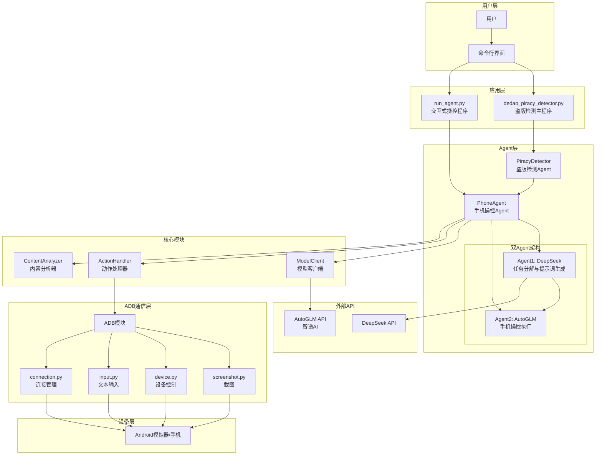
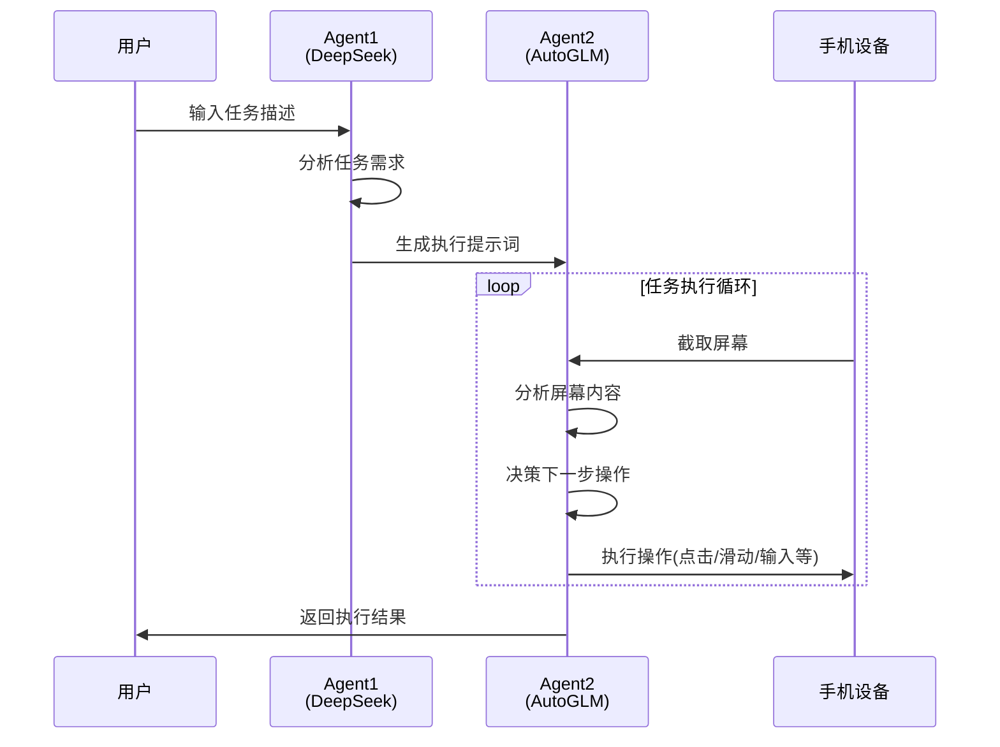
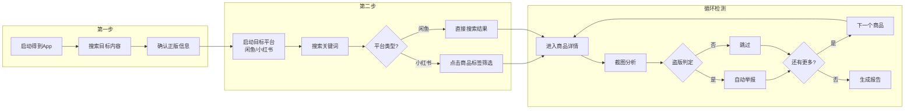
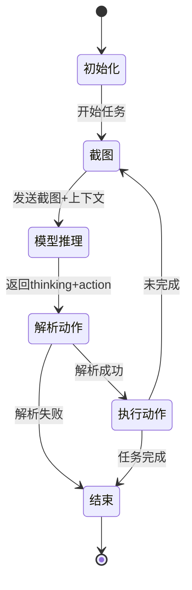

# 盗版检测及交互任务Agent系统

基于AI大模型的手机自动化操控框架，实现在闲鱼/小红书等平台自动检测和举报盗版"得到"App内容。

同时也能实现相关开放式任务。

## 系统架构



## 功能概述

### 核心功能

| 功能模块 | 描述 |
|---------|------|
| **盗版检测** | 自动在闲鱼/小红书搜索疑似盗版商品，通过多模态分析识别盗版特征 |
| **智能操控** | 基于视觉语言模型(VLM)理解手机屏幕内容并执行操作 |
| **自动举报** | 检测到高置信度盗版内容后自动执行举报流程 |
| **交互式控制** | 支持用户输入自然语言任务，Agent自动执行 |

### 双Agent协作机制



## 目录结构

```
bohack-project/
├── dedao_piracy_detector.py   # 盗版检测主程序入口
├── run_agent.py               # 交互式手机操控入口
├── requirements.txt           # Python依赖
│
└── phone_agent/               # 核心框架包
    ├── __init__.py            # 包入口，导出PhoneAgent
    ├── agent.py               # PhoneAgent主类，任务执行循环
    │
    ├── model/                 # 模型客户端
    │   ├── __init__.py
    │   └── client.py          # OpenAI兼容API客户端，消息构建器
    │
    ├── actions/               # 动作处理
    │   ├── __init__.py
    │   └── handler.py         # 动作解析与执行(点击/滑动/输入等)
    │
    ├── adb/                   # ADB通信层
    │   ├── __init__.py        # 统一导出接口
    │   ├── screenshot.py      # 截图功能
    │   ├── device.py          # 设备控制(点击/滑动/启动App等)
    │   ├── input.py           # 文本输入(ADB键盘)
    │   └── connection.py      # 设备连接管理
    │
    └── config/                # 配置与提示词
        ├── __init__.py
        ├── prompts_zh.py      # Agent2中文系统提示词
        ├── prompts_piracy.py  # Agent1提示词生成器
        ├── apps.py            # App包名映射
        ├── i18n.py            # 国际化消息
        └── timing.py          # 操作延时配置
```

## 盗版检测流程



## 环境配置

### 系统要求

- Python 3.10+
- ADB (Android Debug Bridge)
- Android模拟器 或 已开启USB调试的Android手机

### 安装依赖

```bash
pip install -r requirements.txt
```

### ADB环境配置

1. **安装ADB工具**
   - Windows: 下载Android SDK Platform Tools并添加到PATH
   - macOS: `brew install android-platform-tools`
   - Linux: `sudo apt install adb`

2. **连接设备**
   ```bash
   # 模拟器连接(以MuMu为例)
   adb connect 127.0.0.1:5555
   
   # 查看已连接设备
   adb devices
   ```

3. **安装ADB键盘**(可选，用于中文输入)
   ```bash
   adb install ADBKeyboard.apk
   ```

### API配置

程序默认使用智谱AI的AutoGLM模型，需配置API：

| 参数 | 默认值 | 说明 |
|------|--------|------|
| `--base-url` | `https://open.bigmodel.cn/api/paas/v4` | AutoGLM API地址 |
| `--model` | `autoglm-phone` | 模型名称 |
| `--apikey` | `EMPTY` | API Key |
| `--deepseek-key` | - | DeepSeek API Key(Agent1) |

## 使用方法

### 盗版检测模式

```bash
# 基本用法 - 交互式选择平台
python dedao_piracy_detector.py

# 指定平台和关键词
python dedao_piracy_detector.py --platform xianyu --keyword "薛兆丰经济学"

# 指定检测数量和自动举报
python dedao_piracy_detector.py --platform xiaohongshu --max-items 20 --auto-report

# 完整参数示例
python dedao_piracy_detector.py \
    --platform xianyu \
    --keyword "得到电子书" \
    --max-items 15 \
    --base-url "https://open.bigmodel.cn/api/paas/v4" \
    --model "autoglm-phone" \
    --apikey "your-api-key" \
    --connect 127.0.0.1:7555 \
    --auto-report
```

### 交互式操控模式

```bash
# 启动交互式Agent
python run_agent.py

# 指定设备连接
python run_agent.py --connect 127.0.0.1:7555

# 指定DeepSeek API Key
python run_agent.py --deepseek-key "your-deepseek-key"
```

**交互示例：**
```
📝 请输入要完成的任务: 打开淘宝搜索iPhone手机壳
📱 目标平台(可选，直接回车跳过): 淘宝

🤖 Agent1 (DeepSeek) 正在生成提示词...
📝 DeepSeek 生成的任务提示词:
...
🚀 Agent2 (AutoGLM) 开始执行任务...
```

### 命令行参数说明

| 参数 | 简写 | 说明 | 默认值 |
|------|------|------|--------|
| `--platform` | - | 目标平台: xianyu/xiaohongshu | 交互选择 |
| `--keyword` | `-k` | 搜索关键词 | 薛兆丰漫画经济学 |
| `--max-items` | - | 最大检测商品数 | 10 |
| `--auto-report` | - | 自动举报高置信度盗版 | False |
| `--base-url` | - | 模型API地址 | 智谱AI |
| `--model` | - | 模型名称 | autoglm-phone |
| `--apikey` | - | API密钥 | EMPTY |
| `--device-id` | `-d` | ADB设备ID | 自动检测 |
| `--connect` | `-c` | 连接设备地址 | - |

## 盗版识别规则

### 盗版特征关键词
- 网盘、百度云、阿里云盘、夸克、链接、提取码
- 电子版、PDF、epub、音频、MP3、视频
- 打包、全集、合集、资源、私发、秒发

### 正版二手特征
- 二手、闲置、转让、实体书、纸质、正版
- 九成新、八成新、包邮、自提

### 判定逻辑
- **高置信度盗版**: 仅检测到盗版特征，置信度 > 60%
- **可疑内容**: 同时存在盗版和正版特征，需人工确认
- **正版二手**: 仅检测到正版特征

## 检测报告

程序运行完成后自动生成JSON格式报告：

```json
{
  "summary": {
    "platform": "xianyu",
    "checked": 10,
    "piracy_found": 3,
    "reported": 2
  },
  "records": [
    {
      "time": "2024-12-27T15:30:00",
      "title": "得到电子书全集PDF",
      "price": "9.9",
      "is_piracy": true,
      "confidence": 0.85,
      "reasoning": "检测到3项盗版特征",
      "reported": true
    }
  ]
}
```

## 技术架构说明

### PhoneAgent核心循环



### 支持的操作指令

| 指令 | 说明 | 示例 |
|------|------|------|
| `Launch` | 启动应用 | `do(action="Launch", app="闲鱼")` |
| `Tap` | 点击坐标 | `do(action="Tap", element=[500,500])` |
| `Type` | 输入文本 | `do(action="Type", text="搜索内容")` |
| `Swipe` | 滑动手势 | `do(action="Swipe", start=[500,800], end=[500,200])` |
| `Back` | 返回 | `do(action="Back")` |
| `Home` | 主屏幕 | `do(action="Home")` |
| `Wait` | 等待 | `do(action="Wait", duration="2 seconds")` |
| `finish` | 完成任务 | `finish(message="任务完成")` |

## 注意事项

1. **设备准备**: 确保模拟器/手机已安装目标App(得到、闲鱼、小红书)并已登录
2. **网络环境**: 需要稳定的网络连接访问AI模型API
3. **操作延时**: 不同设备性能可能导致操作延时差异，可在`config/timing.py`调整
4. **敏感操作**: 涉及支付、隐私等敏感操作时会请求用户确认
5. **举报责任**: 自动举报功能请谨慎使用，确保内容确实侵权

## License

MIT License
